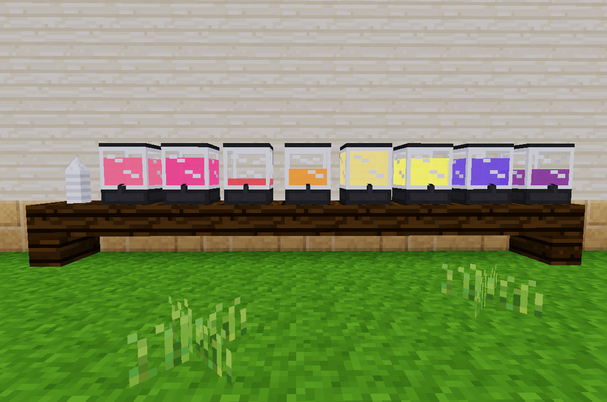

# Snowcones #

Time for a popular summer treat.  

### Flavors ###
This mod depends on [`farming_redo`](https://notabug.org/tenplus1/farming). Otherwise the only good fruit available would be blueberries.  

* Banana
* Blueberry
* Grape
* Orange
* Pineapple
* Raspberry
* Strawberry
* Watermelon

_"But why are there no green colors?"_  
Because there are no green fruits included. If someone were to make a citrus mod with lemons/limes, that would be great.  

### Items ###
* Snowcone Cup
* Snowcone (Raw)
* Snowcone (Various flavors, restores 1 hp)
* Bucket of Syrup (Various flavors, fills 16 servings)
* Syrup Container (Holds up to 64 servings)
* Stack of Cups

### Crafting Recipes ###
* Snowcone Cup (3) `snowcone:cup_1`  
	```
	P = default:paper
	[P][ ][P]
	[ ][P][ ]
	```
* Snowcone (Raw) `snowcone:raw`  
	```
	C = snowcone:cup, S = default:snow
	[C][S] (Shapeless)
	```
* Syrup Container `snowcone:container`  
	```
	T = default:tin_ingot, G = default:glass
	B = bucket:bucket_empty
	[T][T][T]
	[G][ ][G]
	[T][B][T]
	```
* Bucket of Syrup `snowcone:bucket_syrup_[flavor]`  
	```
	F = Flavor Item, B = bucket:bucket_empty
	J = farming:juicer, S = farming:sugar
	[J][B][ ]
	[F][F][S] (Shapless)
	[F][F][S]
	```
	Flavor Items:
	* `ethereal:banana`
	* `default:blueberries`
	* `farming:blueberries`
	* `farming:grapes`
	* `ethereal:orange`
	* `farming:pineapple_ring`
	* `farming:raspberries`
	* `ethereal:strawberry`
	* `farming:melon_slice`
* Stack of Cups `snowcone:cup_[count]`  
	```
	C = snowcone:cup_1
	[C] x [count]
	```

### Usage ###
1. Craft a container and place it
2. Craft a cup
3. Craft a bucket of syrup
4. Rightclick the container with the syrup
5. Craft a raw snow cone
6. Rightclick the container with the snowcone to add flavor
7. Enjoy

Punching a stack of cups will add 1 cup to your inventory.  
Rightclicking a stack of cups with a cup will add a cup to it.  

If there is not enough room in a container to add 16 servings, the bucket will hold the leftovers.  
Syrup can be removed from containers with an empty bucket.  

### Bugs ###
The liquid level inside the containers is sometimes inaccurate.  

### API ###
A single function is provided that may be used in other mods.  
`snowcone.register_flavor(flavor, def)`  

`flavor` is a string.  
`def` is a table:
```
{
	color = ColorString,
	alpha = number 0-255 (optional),
	craftitem = itemstring (optional, needed for obtaining syrup)
}
